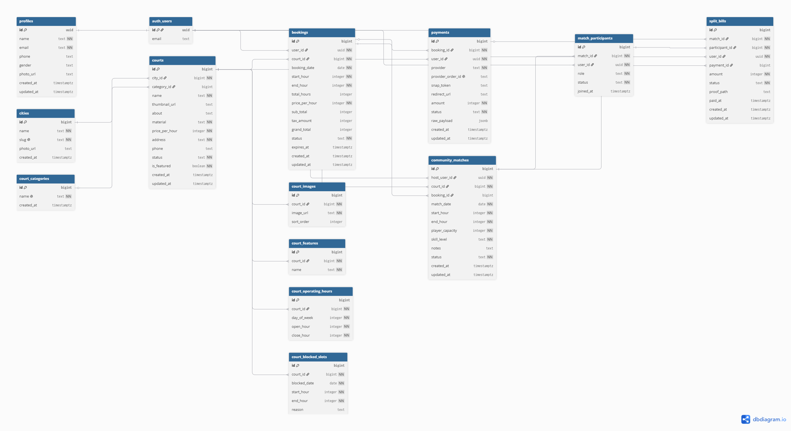

# PadalPro

PadalPro adalah aplikasi mobile berbasis Flutter untuk membantu proses booking
lapangan padel, mencari teman bermain melalui Community open match, dan mencatat
pembayaran patungan atau split bill.

Project ini dibuat sebagai final project mata kuliah **Mobile Computing**. Fokus
utama project ini bukan hanya membuat tampilan aplikasi, tetapi juga menerapkan
materi yang sudah dipelajari selama perkuliahan, seperti widget, navigation,
stateful/stateless, FutureBuilder, StreamBuilder, BLoC, local storage, dan
integrasi backend.

## Anggota Tim

| Nama | NIM | Program Studi |
| --- | --- | --- |
| Mohammad Zilan Afiat Suryaditama | 24110300036 | Ilmu Komputer |
| Novendy Farhanudin | 24110300068 | Ilmu Komputer |
| Laily Sulusiyah | 24110500020 | Data Science |

## Latar Belakang Project

Permasalahan yang kami angkat adalah proses booking lapangan padel dan mencari
partner bermain yang masih bisa dibuat lebih praktis.

Beberapa masalah yang ingin diselesaikan:

- User perlu cara yang mudah untuk melihat daftar lapangan padel.
- User perlu melihat detail lapangan, lokasi, harga, dan slot waktu.
- Proses booking sebaiknya terdokumentasi, bukan hanya lewat chat manual.
- Banyak pemain ingin bermain, tetapi belum tentu punya partner atau grup.
- Saat bermain berempat, pembayaran patungan sering perlu dicatat dengan jelas.
- User perlu melihat status booking dan pembayaran setelah melakukan transaksi.

Berdasarkan masalah tersebut, kami membuat **PadalPro** sebagai aplikasi booking
lapangan padel sekaligus platform sederhana untuk membuat Community open match.

## Solusi yang Dibuat

PadalPro menyediakan beberapa fitur utama:

- **Authentication**
  User bisa register, login, logout, reset password, dan session login tetap
  dikenali selama belum logout.

- **Browse Court**
  User bisa melihat daftar lapangan, kota, featured court, dan detail lapangan.

- **Search**
  User bisa mencari lapangan atau lokasi. Aplikasi juga menyimpan recent search
  agar pencarian sebelumnya mudah dipakai lagi.

- **Normal Booking**
  User bisa memilih court, tanggal, time slot, lalu membuat booking.

- **Payment Proof Upload**
  User bisa upload bukti pembayaran. Setelah bukti dikirim, status booking bisa
  berubah menjadi paid.

- **My Bookings**
  User bisa melihat daftar booking miliknya dan membuka detail booking.

- **Realtime Booking Detail**
  Detail booking menggunakan StreamBuilder sehingga status booking bisa berubah
  mengikuti data dari backend.

- **Community Open Match**
  User bisa membuat match terbuka agar pemain lain bisa ikut join.

- **Split Bill**
  Saat match penuh, sistem membuat split bill untuk masing-masing participant.

- **Scoreboard**
  Match yang sudah paid bisa membuka halaman scoreboard.

- **Profile**
  User bisa edit profile, upload foto profile, change password, dan logout.

## Jumlah Halaman

Saat ini project memiliki **22 halaman/screen** di folder
`lib/presentation/pages`.

| No | Halaman | Fungsi |
| --- | --- | --- |
| 1 | Splash | Tampilan awal dan pengecekan session login |
| 2 | Onboarding | Pengenalan singkat aplikasi |
| 3 | Get Started | Halaman awal menuju login/register |
| 4 | Sign In | Login user |
| 5 | Sign Up | Registrasi user baru |
| 6 | Reset Password | Reset password user |
| 7 | Browse/Home | Halaman utama untuk melihat court, city, dan next booking |
| 8 | Search | Pencarian lapangan/lokasi dan recent search |
| 9 | City Details | Daftar court berdasarkan kota |
| 10 | Court Details | Detail lapangan dan aksi booking/create match |
| 11 | Booking | Pemilihan tanggal dan time slot |
| 12 | Payment | Upload bukti pembayaran |
| 13 | Success Booking | Konfirmasi booking berhasil |
| 14 | My Bookings | Daftar booking milik user |
| 15 | Booking Details | Detail booking dan realtime status |
| 16 | Community | Daftar open match |
| 17 | Create Match | Membuat Community open match |
| 18 | Community Match Details | Detail match, participant, dan split bill |
| 19 | Scoreboard | Pencatatan skor match |
| 20 | Profile | Informasi profile user |
| 21 | Edit Profile | Update data profile dan foto |
| 22 | Change Password | Mengubah password akun |

## Flow Aplikasi

Flow utama aplikasi dimulai dari pengecekan session. Jika user sudah login,
aplikasi masuk ke Home. Jika belum login, user diarahkan ke onboarding dan auth.

```text
Splash
  -> Cek session login
  -> Jika belum login: Onboarding / Get Started -> Sign In / Sign Up
  -> Jika sudah login: Browse/Home
```

Setelah masuk ke aplikasi, user bisa berpindah ke beberapa fitur utama:

```text
Browse/Home
  -> Search
  -> City Details
  -> Court Details
  -> My Bookings
  -> Community
  -> Profile
```

Flow booking normal:

```text
Login
  -> Browse/Home
  -> Pilih Court
  -> Court Details
  -> Book Now
  -> Pilih tanggal dan time slot
  -> Booking dibuat
  -> Payment Page
  -> Upload bukti pembayaran
  -> Success Booking
  -> My Bookings / Booking Details
```

Flow Community open match:

```text
Login
  -> Community
  -> Create Open Match
  -> User lain join match
  -> Jika participant sudah penuh, sistem membuat booking
  -> Split bill dibuat untuk setiap participant
  -> Semua participant upload bukti pembayaran
  -> Match dan booking berubah menjadi paid
  -> Scoreboard dapat dibuka
```

## Arsitektur Project

Project ini memakai pendekatan berlapis agar kode lebih rapi dan mudah
dikembangkan. Setiap layer punya tanggung jawab masing-masing.

```text
UI / Page
  -> BLoC
  -> Domain Repository Interface
  -> Data Repository Implementation
  -> Data Source
  -> Supabase / Local Storage
```

Penjelasan sederhananya:

- **UI/Page**
  Bagian yang dilihat dan digunakan user. Contohnya halaman Browse, Search,
  Booking, Payment, Community, dan Profile.

- **BLoC**
  Bagian yang mengatur state aplikasi. UI tidak langsung mengatur semua logic
  sendiri, tetapi mengirim event ke BLoC, lalu BLoC mengeluarkan state baru.

- **Domain**
  Bagian yang menyimpan aturan atau kontrak utama aplikasi, seperti entity dan
  repository interface. Layer ini membantu agar kode tidak terlalu bergantung
  langsung ke Supabase.

- **Data**
  Bagian yang mengambil data dari backend atau local storage. Di sini ada
  datasource, model, dan repository implementation.

- **Supabase / Local Storage**
  Supabase digunakan untuk auth, database, storage, RPC, dan realtime. Local
  storage digunakan untuk data lokal seperti recent search dan cache/session.

Struktur folder utama:

```text
lib
  core
  data
  domain
  presentation
supabase
  migrations
  functions
  seed.sql
```

Penjelasan folder:

- `lib/core`
  Berisi konfigurasi global seperti theme, constants, error handling,
  dependency injection, helper snackbar, route observer, dan upload storage.

- `lib/data`
  Berisi datasource, model, dan repository implementation. Layer ini yang
  berhubungan langsung dengan Supabase atau local storage.

- `lib/domain`
  Berisi entity, repository interface, dan use case. Layer ini menjadi kontrak
  agar business logic tidak terlalu bergantung ke detail database.

- `lib/presentation`
  Berisi halaman, widget, dan BLoC. Layer ini fokus ke tampilan dan state UI.

- `supabase`
  Berisi migration SQL, seed data, dan Edge Functions.

BLoC yang digunakan:

- `AuthBloc` untuk login, register, logout, reset password, update profile, dan
  change password.
- `CityBloc` untuk mengambil daftar kota.
- `CourtBloc` untuk featured court, popular court, search court, dan detail
  court.
- `BookingBloc` untuk next booking dan daftar booking user.
- `CommunityBloc` untuk open match, join match, split bill, dan cancel match.

Contoh penggunaan BLoC di `lib/main.dart`:

```dart
return MultiBlocProvider(
  providers: [
    BlocProvider(
      create: (_) => sl<AuthBloc>()..add(const AuthCheckRequested()),
    ),
    BlocProvider(
      create: (_) => sl<CityBloc>()..add(const CitiesFetchRequested()),
    ),
    BlocProvider(
      create: (_) =>
          sl<CourtBloc>()..add(const FeaturedCourtsFetchRequested()),
    ),
    BlocProvider(create: (_) => sl<BookingBloc>()),
    BlocProvider(create: (_) => sl<CommunityBloc>()),
  ],
  child: MaterialApp(
    title: AppConstants.appName,
    theme: AppTheme.lightTheme,
    home: const AuthSessionSync(child: SplashPage()),
  ),
);
```

Maksud kode di atas:

- `MultiBlocProvider` menyediakan beberapa BLoC agar bisa dipakai oleh halaman
  di dalam aplikasi.
- `AuthBloc` langsung menjalankan `AuthCheckRequested()` untuk mengecek apakah
  user sudah login.
- `CityBloc` langsung mengambil data kota.
- `CourtBloc` langsung mengambil featured courts untuk Home.
- `BookingBloc` dan `CommunityBloc` disiapkan agar bisa dipakai saat user masuk
  ke halaman booking dan community.

## Materi Kuliah yang Sudah Diterapkan

| Materi | Implementasi di PadalPro |
| --- | --- |
| Instalasi tools & setup | Project Flutter sudah bisa dijalankan di emulator/Chrome dan terhubung ke Supabase |
| Intro Mobile App Development | Aplikasi memiliki flow mobile end-to-end dari auth sampai booking |
| Native vs Flutter | Project memakai Flutter untuk membuat aplikasi mobile cross-platform |
| Everything is a Widget | UI dibuat dari widget Flutter, termasuk page, card, button, form, dan navigation |
| Navigation | Menggunakan `Navigator`, `MaterialPageRoute`, `push`, `pushReplacement`, `pushAndRemoveUntil`, dan bottom navigation |
| Stateless & Stateful | Menggunakan `StatelessWidget` untuk UI statis dan `StatefulWidget` untuk UI yang punya state |
| FutureBuilder | Digunakan di Search Page untuk menampilkan recent search dari local storage |
| StreamBuilder | Digunakan di Booking Details untuk menampilkan status booking secara realtime |
| BLoC | Digunakan untuk Auth, City, Court, Booking, dan Community |

Kesimpulan progress:

> Dengan kondisi project saat ini, semua materi utama yang sudah diajarkan sudah
> diterapkan di project. Implementasinya juga bukan hanya contoh kecil, tetapi
> masuk ke flow aplikasi yang benar-benar dipakai user.

## FutureBuilder

`FutureBuilder` digunakan untuk data yang diambil sekali atau tidak perlu
didengarkan terus-menerus. Di project ini, contohnya adalah recent search pada
Search Page.

Kenapa recent search cocok memakai FutureBuilder?

- Datanya berasal dari local storage.
- Data cukup diambil saat halaman Search dibuka.
- Jika user menambah, menghapus, atau clear recent search, future bisa
  direfresh.

Potongan kode dari `SearchPage`:

```dart
return FutureBuilder<List<String>>(
  future: _recentSearchesFuture,
  builder: (context, snapshot) {
    final searches = snapshot.data ?? const <String>[];
    if (snapshot.connectionState == ConnectionState.waiting ||
        searches.isEmpty) {
      return const SizedBox.shrink();
    }

    return Column(
      children: [
        _buildRecentSearches(searches),
        const SizedBox(height: 24),
      ],
    );
  },
);
```

## StreamBuilder

`StreamBuilder` digunakan untuk data yang bisa berubah sewaktu-waktu. Di
project ini, contohnya adalah status booking di Booking Details.

Kenapa booking detail cocok memakai StreamBuilder?

- Status booking bisa berubah dari `pending_payment` menjadi `paid`.
- Status booking juga bisa menjadi `expired` atau `cancelled`.
- User tidak perlu keluar-masuk halaman untuk melihat perubahan terbaru.
- Data realtime berasal dari Supabase stream.

Potongan kode dari `BookingDetailsPage`:

```dart
return StreamBuilder<Booking?>(
  stream: _bookingStream,
  initialData: _initialBooking,
  builder: (context, snapshot) {
    final booking = snapshot.data;

    if (booking == null &&
        snapshot.connectionState == ConnectionState.waiting) {
      return _buildLoadingState();
    }

    if (booking == null) {
      return _buildMessageState(
        context,
        icon: Icons.error_outline,
        title: 'Booking not found',
      );
    }

    return _buildBookingDetails(context, booking);
  },
);
```

Stream booking berasal dari datasource Supabase:

```dart
Stream<BookingModel?> watchBookingById(int bookingId) {
  if (_supabaseClient.auth.currentUser == null) {
    return Stream.value(null);
  }

  return _supabaseClient
      .from('bookings')
      .stream(primaryKey: ['id'])
      .eq('id', bookingId)
      .asyncMap((rows) async {
        if (rows.isEmpty) return null;
        final bookings = await _hydrateBookingModels(rows);
        return bookings.isEmpty ? null : bookings.first;
      });
}
```

## Library yang Digunakan

Dependencies utama:

| Library | Fungsi |
| --- | --- |
| `flutter_bloc` | State management menggunakan pola BLoC |
| `equatable` | Membantu membandingkan state, event, dan entity |
| `supabase_flutter` | Integrasi Supabase untuk auth, database, storage, RPC, dan realtime |
| `get_it` | Dependency injection atau service locator |
| `dartz` | Menggunakan `Either` untuk membedakan success dan failure |
| `flutter_secure_storage` | Menyimpan data sensitif seperti token/session secara lebih aman |
| `shared_preferences` | Menyimpan data lokal sederhana seperti recent search |
| `image_picker` | Memilih gambar untuk foto profile dan bukti pembayaran |
| `cached_network_image` | Menampilkan dan cache gambar dari URL |
| `google_fonts` | Menggunakan font dari Google Fonts |
| `intl` | Format tanggal, jam, dan angka |
| `url_launcher` | Membuka phone call atau link dari aplikasi |

Dev dependencies:

| Library | Fungsi |
| --- | --- |
| `flutter_lints` | Membantu menjaga kualitas kode dengan aturan lint |
| `flutter_launcher_icons` | Generate app icon |
| `flutter_native_splash` | Generate splash screen native |
| `flutter_test` | Menjalankan test Flutter |

## Backend Supabase

Supabase digunakan sebagai backend utama aplikasi.

Fungsi Supabase di project:

- **Authentication**
  Untuk register, login, logout, reset password, dan session user.

- **Database**
  Untuk menyimpan data user profile, city, court, booking, community match,
  participant, payment, dan split bill.

- **Storage**
  Untuk menyimpan foto profile dan bukti pembayaran.

- **RPC**
  Untuk logic yang lebih aman dijalankan di database, seperti create booking,
  cek slot, expiry booking, join match, dan split bill.

- **Realtime**
  Untuk membaca perubahan status booking secara realtime di Booking Details.

- **RLS Policy**
  Untuk membatasi akses data agar user hanya bisa membaca/mengubah data yang
  sesuai hak aksesnya.

Panduan backend ada di `supabase/README.md`.

## Rancangan Database / ERD

Database PadalPro dibagi menjadi empat kelompok data utama:

- **User dan profile**: `auth_users` dan `profiles`.
- **Master lapangan**: `cities`, `court_categories`, `courts`, dan detail court.
- **Booking dan payment**: `bookings` dan `payments`.
- **Community match**: `community_matches`, `match_participants`, dan
  `split_bills`.

ERD berikut dibuat menggunakan dbdiagram.io berdasarkan migration Supabase di
folder `supabase/migrations`.



Relasi utama database:

| Jenis Relasi | Relasi | Penjelasan |
| --- | --- | --- |
| One-to-one | `auth_users` -> `profiles` | Satu akun login memiliki satu profile aplikasi |
| One-to-many | `cities` -> `courts` | Satu kota dapat memiliki banyak lapangan |
| One-to-many | `court_categories` -> `courts` | Satu kategori dapat dipakai oleh banyak lapangan |
| One-to-many | `courts` -> `bookings` | Satu lapangan dapat memiliki banyak booking |
| One-to-many | `auth_users` -> `bookings` | Satu user dapat membuat banyak booking |
| One-to-many | `bookings` -> `payments` | Satu booking dapat memiliki beberapa catatan pembayaran |
| One-to-many | `courts` -> `community_matches` | Satu lapangan dapat dipakai untuk banyak open match |
| One-to-many | `auth_users` -> `community_matches` | Satu user dapat menjadi host untuk banyak open match |
| One-to-many | `community_matches` -> `match_participants` | Satu match dapat memiliki banyak participant |
| One-to-many | `community_matches` -> `split_bills` | Satu match dapat menghasilkan banyak tagihan patungan |
| One-to-one | `match_participants` -> `split_bills` | Satu participant memiliki satu split bill pada satu match |
| Optional one-to-one | `community_matches` -> `bookings` | Match baru terhubung ke booking setelah participant penuh |
| Optional one-to-one | `split_bills` -> `payments` | Split bill baru terhubung ke payment setelah user membayar |

Relasi many-to-many di project ini dibuat melalui tabel penghubung:

- User dan Community Match adalah **many-to-many** karena satu user bisa ikut
  banyak match, dan satu match memiliki banyak user. Relasi ini disimpan melalui
  tabel `match_participants`.
- Participant dan pembayaran patungan dipecah melalui tabel `split_bills` agar
  setiap user memiliki nominal dan status pembayaran masing-masing.

Catatan implementasi database:

- Supabase Auth tetap memakai tabel internal `auth.users`.
- Tabel `profiles` dipakai untuk data profile yang dibutuhkan aplikasi.
- Booking memakai constraint agar slot court yang sama tidak bisa double-booking
  pada tanggal dan jam yang overlap.
- RLS policy digunakan agar akses data tetap dibatasi sesuai user yang login.

## Setup Lokal

Install dependency:

```powershell
flutter pub get
```

Jalankan pengecekan:

```powershell
flutter analyze
flutter test
```

Jalankan app di emulator/device Android:

```powershell
flutter devices
flutter run -d emulator-5554 `
  --dart-define=SUPABASE_URL="https://YOUR_PROJECT_REF.supabase.co" `
  --dart-define=SUPABASE_ANON_KEY="YOUR_SUPABASE_PUBLISHABLE_OR_ANON_KEY"
```

Jika emulator terasa berat, app juga bisa dijalankan di Chrome:

```powershell
flutter run -d chrome --web-port 8080 `
  --no-web-resources-cdn `
  --dart-define=SUPABASE_URL="https://YOUR_PROJECT_REF.supabase.co" `
  --dart-define=SUPABASE_ANON_KEY="YOUR_SUPABASE_PUBLISHABLE_OR_ANON_KEY"
```

Catatan penting:

- Flutter app hanya boleh memakai Project URL dan publishable/anon key.
- Jangan memasukkan Supabase service role key ke aplikasi mobile.
- Untuk testing tim, gunakan Supabase project yang sama agar data booking,
  community match, dan split bill terkumpul di backend yang sama.

## Testing dan Status Progress

Verifikasi terakhir:

- `flutter analyze`: no issues found.
- `flutter test`: all tests passed.
